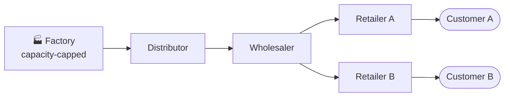

# Beer Distribution RL

**Do self-interested supply-chain agents rediscover the bullwhip effect — and learn to game it?**

Independent, selfish agents — classical MARL policies and small LLMs — play an
extended [Beer Distribution Game](https://en.wikipedia.org/wiki/Beer_distribution_game).
Each agent has its own parameters and is rewarded **only on its own local costs**.
We add a capacity-constrained factory with order-inflating rationing, an optional
(and unverified) cheap-talk channel, and a two-retailer "Y" topology, then ask
whether cooperation — or deception — *emerges* from pure self-interest.



<sub>Goods flow downstream (left → right); **orders** flow back upstream. Under a
tight factory cap, the two retailers compete for a rationed supply — the setup
where shortage gaming appears.</sub>

> **Status.** Classical RL (Tier 1) is done and holds its headline result: trained
> agents rediscover 1997-style **shortage gaming** under tight capacity. The LLM
> tier (Tier 2) is in its free capability-floor phase — see [`CURRENT_STATE.md`](CURRENT_STATE.md).
> **$0 of the $250 budget spent.**

📄 [Research spec](PROJECT_SPEC.md) · 🧭 [Design decisions](DECISIONS.md) · 📌 [Current state](CURRENT_STATE.md)

---

## 🎬 Live spectator

Watch a game play out in your browser: two retailers under one wholesaler, live
orders and shipments flowing through the chain, per-retailer customer demand, and
running per-player costs. Play / Pause / Step / Restart, with a speed slider.
Frames stream over WebSocket straight from the simulator.

```bash
pip install -e ".[web]"
python scripts/serve_spectator.py        # then open http://127.0.0.1:8000
```

---

## Key findings

| Finding | Result |
|---|---|
| **Shortage gaming emerges** (Y-topology, tight capacity, proportional rationing) | ✅ Supported — agents inflate orders to grab a larger rationed share |
| **Honest signaling emerges** from selfish agents | ❌ Refuted — the cheap-talk channel is inert; the strategy lives in the order stream |
| **Honesty-weighted rationing restores truth-telling** | ❌ Refuted — agents disengage from the channel rather than tell the truth |
| **Qwen2.5-3B clears the LLM capability floor** | ❌ Not yet — parses cleanly (0% fail) but collapses to near-zero orders; move up a size |


<sub>**The headline result.** As factory capacity tightens (left → right), agents
order further *above* the base-stock benchmark — but only under **proportional**
rationing (solid/blue), which rewards claiming a bigger share. Under **uniform**
rationing (dashed/orange), where inflation earns nothing, orders fall back toward
or below the benchmark. Y-topology, AR(1) demand, 10 seeds, matched-deterministic eval.</sub>

---

## Install

```bash
pip install -e ".[dev]"               # env + tests (pure-Python core, no ML deps)
pip install -e ".[dev,wrappers]"      # + PettingZoo / Gymnasium
pip install -e ".[dev,wrappers,marl]" # + PyTorch IPPO (Tier 1)
pip install -e ".[web]"               # + live spectator UI (FastAPI)
```

## Quickstart

```bash
# 1. Validation gate — env must reproduce published baselines before training
python scripts/validation_gate.py

# 2. Tier-1 IPPO — one policy + critic PER ROLE, no parameter sharing
python scripts/train_ippo.py --config experiments/regime_a_classic.yaml --seed 0
python scripts/run_tier1_matrix.py --dry-run     # pruned cell count
python scripts/run_tier1_matrix.py --workers 8 --n-envs 64 --skip-existing

# 3. LLM capability floor — can a model even play coherently? ($0, free Colab)
python scripts/run_llm_episode.py --backend heuristic --cell classic   # no-model baseline
#   full test: notebooks/colab_llm_smoke.ipynb  (Ollama + Qwen, T4 GPU)
```

**Emergence constraints (non-negotiable):** one policy/LoRA per role, no shared
weights or critics; rewards are strictly local costs; signaling is optional and
unverified, honesty is *measured* — never rewarded. Regime C (shared system
reward) exists only as a reproduction anchor.

## Package layout

```
beer_distribution_rl/
  env/          # pure-Python game core — no ML deps, fully tested
  agents/
    baselines.py   # base-stock, Sterman, random
    ippo/          # Tier 1: Independent PPO
    llm/           # Tier 2: prompt serializer, rolling memory, constrained decoder
  web/          # live spectator (FastAPI + WebSocket + static UI)
scripts/        # validation gate, training, matrix runner, spectator, LLM episode
notebooks/      # Colab: Tier-1 matrix + LLM capability-floor smoke
experiments/    # one YAML per matrix cell
```
