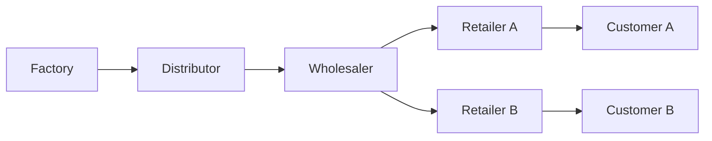

# Beer Distribution Game for RL and LLM Agents

A deterministic multi-agent supply-chain environment for studying delayed
control, the bullwhip effect, and strategic ordering under scarcity.

The repository contains two related research artifacts:

- a classical multi-agent RL simulator with Gymnasium, PettingZoo, IPPO, and
  recurrent-policy experiments;
- a publication-oriented [Verifiers](https://github.com/PrimeIntellect/verifiers)
  environment where one LLM controls one supply-chain role through a strict tool.



Goods move downstream; orders move upstream. Delays and local information can
amplify small demand changes into unstable ordering.

## What the LLM environment tests

Every week the model receives a seeded local observation and must call:

```text
place_order(quantity: integer from 0 through 128)
```

The model never sees future demand or another role's private state. Scripted,
deterministic counterparties control the remaining roles. Episodes contain 36
decision weeks followed by deterministic settlement.

| Tier | Change | Capability |
|---:|---|---|
| 1 | Constant demand | Protocol use and stable delayed control |
| 2 | Persistent AR(1) demand | Filtering without overreaction |
| 3 | Hidden demand shift | Online change detection |
| 4 | Hidden shipment timing | Bounded-memory belief tracking |
| 5 | Y topology, scarcity, aggressive retailers | Bullwhip control under competing claims |

The primary reward compares controlled-role total cost with a same-seed adaptive
base-stock policy. Fill rate, bullwhip, order volatility, system cost, and protocol
compliance are reported separately. The reward is trace-derived and does not use
an LLM judge.

## Reproducibility

- Scenario seeds use stable SHA-256 derivation and explicit split membership.
- A recorded action sequence exactly reproduces transitions and grading.
- Invalid actions cannot partially mutate simulator state.
- Test seeds are opt-in and are not used for calibration.
- Environment v0.2.0 corrected a base-stock lead-time off-by-one found by a
  one-unit impulse test. Results produced by v1 are not comparable.

## Current evidence

These are development results, not held-out benchmark claims.

| Evaluation | Result |
|---|---|
| Classical RL | Independent policies rediscover shortage gaming under proportional rationing |
| Steady retailer, DeepSeek V4 Flash | Cost 69 vs. base-stock 69; reward 0.500 |
| Tier 5 Y wholesaler, 3 development seeds | Model cost 1,111.8 ± 213.2 vs. base-stock 850.7 ± 326.1; reward 0.423 ± 0.060 |

DeepSeek used the required tool on all 108 wholesaler decisions but lost to
base-stock on every seed. That negative result is retained: the wholesaler is the
main learning target, while the retailer remains a useful protocol/control task.

Compact results and replay actions are in
[`artifacts/hub_llm/deepseek_v4_flash/v0_2_wholesaler_y_development/`](artifacts/hub_llm/deepseek_v4_flash/v0_2_wholesaler_y_development/).

## Quick start

Core simulator and tests:

```bash
python -m pip install -e ".[dev]"
python -m pytest -q
```

Verifiers package validation:

```bash
cd environments/beer_distribution_game
uv sync
uv run validate beer-distribution-game --runtime.type subprocess
uv run eval @ eval.toml --dry-run True
```

Regenerate deterministic heuristic and random baselines:

```bash
PYTHONPATH=environments/beer_distribution_game \
  python scripts/eval_hub_baselines.py
```

Akash configurations read `AKASH_API_KEY` from the process environment and keep
result upload disabled. Start with the one-seed wholesaler smoke configuration;
use the three-seed development configuration only after the smoke is clean.

The first one-GPU RL pilot is documented in
[`notebooks/colab_llm_grpo_wholesaler.ipynb`](notebooks/colab_llm_grpo_wholesaler.ipynb)
and uses the native deterministic simulator/grader with a local JSON action
serializer. A selected adapter still requires a separate native Verifiers
tool-call evaluation before publication.

## Repository map

```text
beer_distribution_rl/             classical simulator, agents, and wrappers
environments/beer_distribution_game/  native Verifiers environment
tests/                             simulator and integration tests
tests/hub/                         Hub environment and calibration tests
scripts/                           evaluation and training entry points
experiments/                       classical RL configurations
artifacts/                         compact results; large run data is ignored
docs/                              environment, reward, and difficulty contracts
```

Normative LLM-environment documentation:

- [`docs/ENVIRONMENT_SPEC.md`](docs/ENVIRONMENT_SPEC.md)
- [`docs/REWARD_SPEC.md`](docs/REWARD_SPEC.md)
- [`docs/DIFFICULTY_LADDER.md`](docs/DIFFICULTY_LADDER.md)
- [`DECISIONS.md`](DECISIONS.md) for the design audit trail

## Next evaluation gate

1. Run a second tool-capable model on the same three wholesaler development seeds.
2. Measure repeated-generation variance on one fixed seed.
3. Freeze the prompt and environment version.
4. Evaluate validation seeds and both Tier 5 mechanism controls.
5. Only then launch a small LoRA/GRPO wholesaler training cell and compare it
   honestly with base-stock.

MIT licensed. No API keys are stored in the repository.
