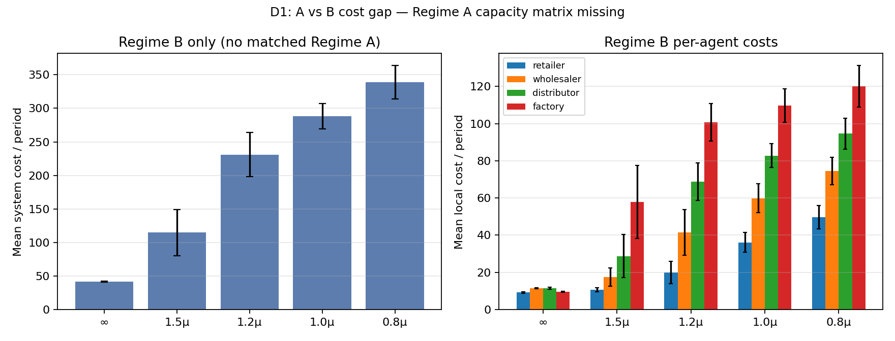
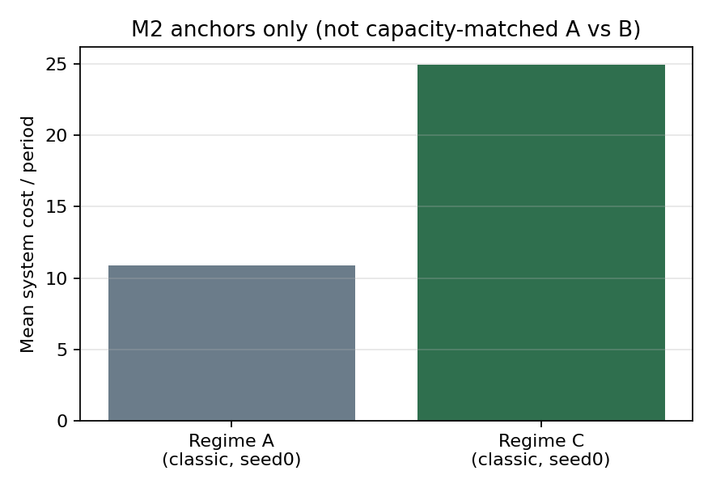
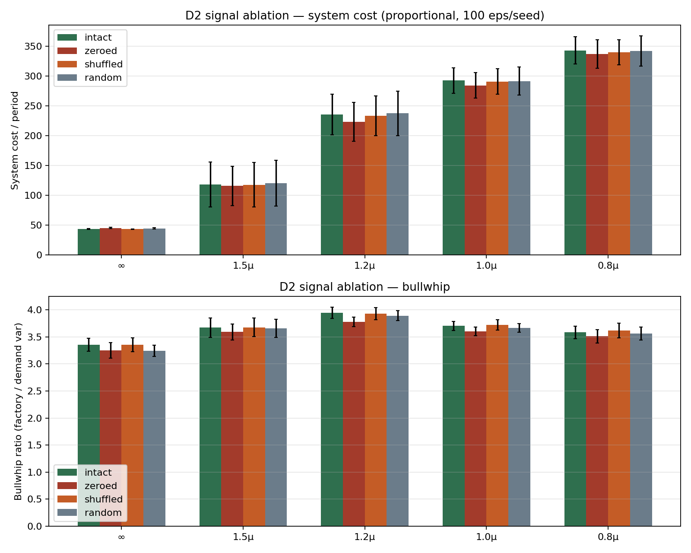
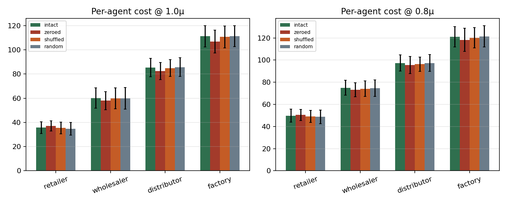
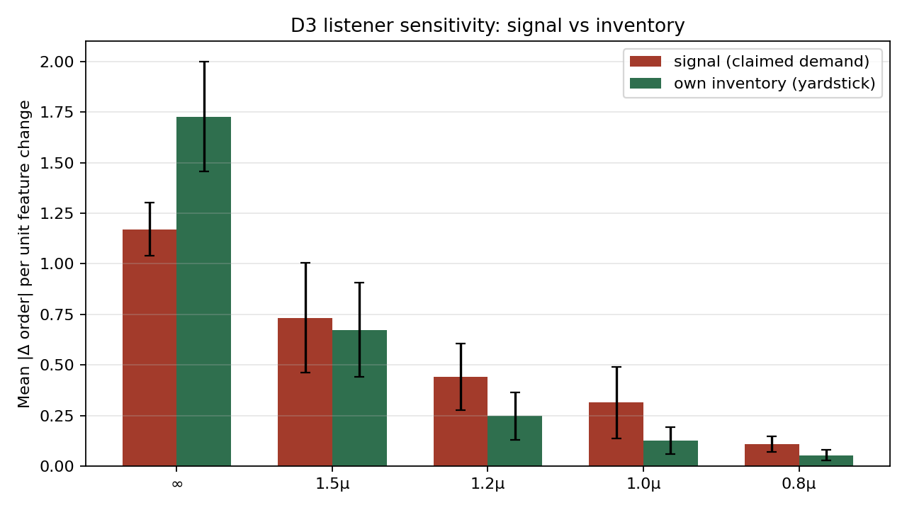
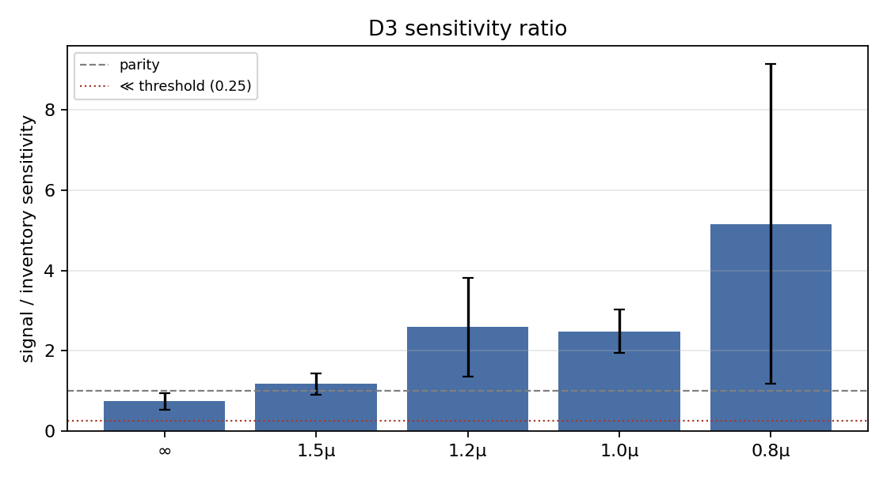
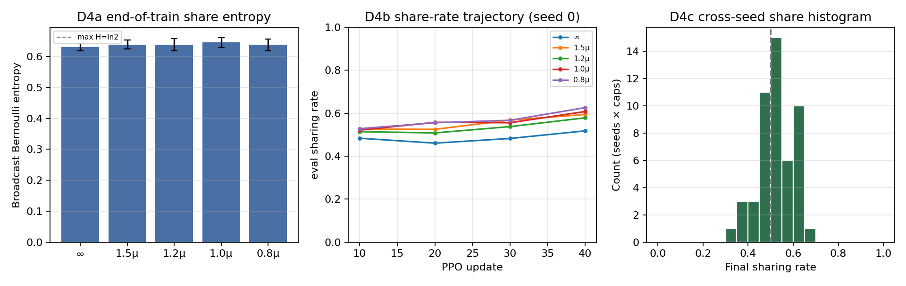
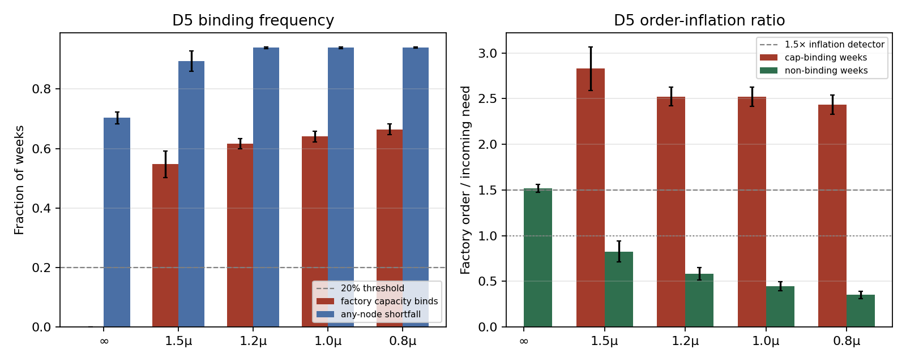
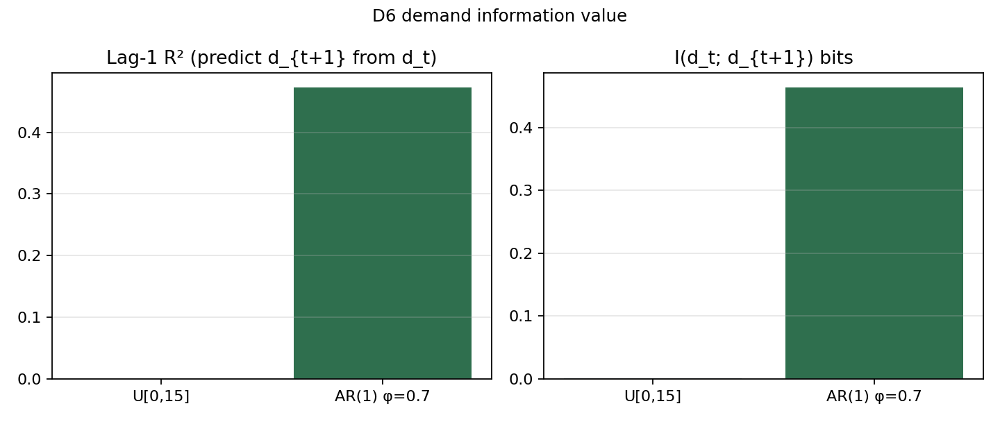
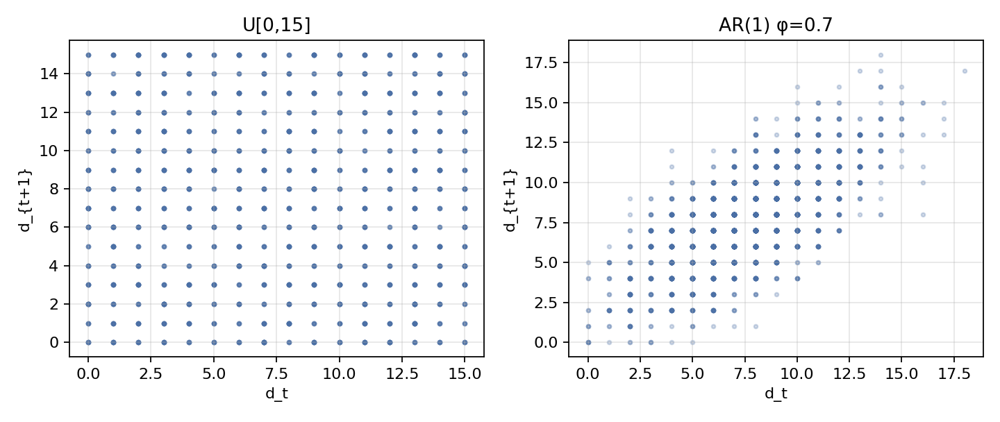

# Tier-1 diagnostics (eval-only)

Root-cause analysis of mediocre Regime-B sharing (~50%), weak honesty, and mild order inflation — **no new training**. Frozen M3 Regime-B checkpoints + existing logs. Figures: `analysis/figs/diag/`. Regenerate: `make diagnostics`.

## Scope & artifacts

- **Matrix available:** Regime B × {∞,1.5μ,1.2μ,1.0μ,0.8μ} × {proportional, honesty_weighted} × 10 seeds (checkpoints present locally).
- **Regime A/C:** M2 classic_step seed0 only — **no capacity-swept A/C matrix**.
- **Primary eval slice:** proportional rationing (on serial topology honesty_weighted ≡ single-claimant fill; policies still differ by seed/run).
- **Seeds:** fixed via `DIAG_EVAL_SEED_OFFSET` in `analysis/diag/common.py`.

## D1 — Does the channel matter at all? (Regime A vs B cost gap)

**Data gap:** Completed M3 matrix is Regime B only (5 caps × 2 rationing × 10 seeds). Regime A exists only as M2 classic_step seed0 (no capacity sweep, demand≠uniform). Matched A vs B cost gaps by capacity therefore cannot be computed from existing logs.

Matched A vs B gaps by capacity are **not computable** from existing logs. Figure below shows Regime B costs only (95% CI across 10 proportional seeds).

| Cap | B system ±CI95 | A system ±CI95 | Gap % of A |
|---|---:|---:|---:|
| ∞ | 41.7±1.0 | n/a | n/a |
| 1.5μ | 114.8±34.5 | n/a | n/a |
| 1.2μ | 230.8±32.9 | n/a | n/a |
| 1.0μ | 288.4±19.1 | n/a | n/a |
| 0.8μ | 338.7±24.9 | n/a | n/a |

**Interpretation key:** cannot apply |gap|<CI test — no Regime A cells. D1 inconclusive on channel economic value: no Regime A capacity matrix. Defer to D2 (signal ablation) for whether the channel is load-bearing.

## D2 — Signal ablation at eval (decisive)

For each frozen Regime-B checkpoint (proportional, n=50), 100 eval episodes × conditions (a) intact (b) signals zeroed (c) shuffled across agents (d) random valid values. Ablation corrupts **listener observations only**; policies still emit signals.

| Cap | intact | zeroed | shuffled | random | max\|Δ\| vs intact | load-bearing? |
|---|---:|---:|---:|---:|---:|---|
| ∞ | 43.4±0.6 | 45.2±1.1 | 43.2±0.6 | 44.5±1.1 | 1.8 | no |
| 1.5μ | 118.1±37.4 | 115.7±33.2 | 117.6±37.1 | 120.4±38.7 | 2.4 | no |
| 1.2μ | 235.7±33.9 | 223.5±32.5 | 233.5±33.6 | 237.4±37.3 | 12.2 | no |
| 1.0μ | 292.5±21.5 | 284.2±21.4 | 291.0±21.6 | 291.7±23.4 | 8.3 | no |
| 0.8μ | 343.1±22.6 | 337.3±23.9 | 339.9±21.2 | 342.1±25.0 | 5.9 | no |

**Result:** (a) not better than (b–d): mean |Δ|≈6.1, mean (ablation−intact)≈-2.1; ignored=5, harmful=0 → listeners do not benefit from channel

**Interpretation key:** (a)≈(b)≈(c)≈(d) ⇒ listeners ignore channel ⇒ babbling ⇒ STRUCTURAL. (a) clearly better ⇒ channel load-bearing.

## D3 — Listener sensitivity probe

Fixed obs batches from intact rollouts; sweep incoming claimed-demand signal features vs own-inventory feature; measure mean |Δ order| per unit feature change.

| Cap | signal sens. | inventory sens. | ratio |
|---|---:|---:|---:|
| ∞ | 1.170±0.131 | 1.727±0.273 | 0.740±0.202 |
| 1.5μ | 0.733±0.270 | 0.673±0.234 | 1.172±0.273 |
| 1.2μ | 0.440±0.165 | 0.247±0.116 | 2.594±1.231 |
| 1.0μ | 0.314±0.177 | 0.126±0.068 | 2.487±0.548 |
| 0.8μ | 0.108±0.040 | 0.053±0.026 | 5.161±3.980 |

**Result:** signal/inventory sensitivity ratio≈2.43 (0/5 caps ≪)

## D4 — Sharing action: indifference vs converged preference

Per seed/agent: (a) Bernoulli entropy of broadcast head at frozen checkpoint; (b) share-rate trajectory from `history.json`; (c) cross-seed final share histogram. Note: training logs only store **joint** multi-head entropy — broadcast entropy was recomputed from checkpoints.

| Cap | share ±CI | H_broadcast ±CI | H/ln2 | frac near 0.5 |
|---|---:|---:|---:|---:|
| ∞ | 0.50±0.03 | 0.631±0.012 | 0.91 | 1.00 |
| 1.5μ | 0.53±0.04 | 0.639±0.015 | 0.92 | 1.00 |
| 1.2μ | 0.52±0.05 | 0.638±0.019 | 0.92 | 0.90 |
| 1.0μ | 0.54±0.06 | 0.645±0.016 | 0.93 | 0.90 |
| 0.8μ | 0.52±0.06 | 0.637±0.018 | 0.92 | 1.00 |

Fraction of runs with share-rate still moving at end of training: **26.0%**.

**Result:** H_broadcast≈0.92·ln2; still-moving seeds≈26.0%; frac near 0.5≈96.0% → indifference (STRUCTURAL)

## D5 — Does rationing ever bind?

**Log gap:** Training logs (final_eval/history) do NOT capture per-week capacity-bind or allocation-shortfall events — only aggregate eval/inflation_rate on info.rationed weeks. D5 recomputes these by re-running eval episodes on frozen checkpoints.

On serial chain, proportional allocation with a single claimant is identity fill-to-available; 'allocation triggers' = physical shortfall (backlog>0 after fill).

| Cap | frac capacity binds | frac allocation shortfall | infl\|binding | infl\|non-binding |
|---|---:|---:|---:|---:|
| ∞ | 0.00±0.00 | 0.70±0.02 | nan±nan | 1.52±0.04 |
| 1.5μ | 0.55±0.04 | 0.89±0.03 | 2.83±0.24 | 0.83±0.11 |
| 1.2μ | 0.62±0.02 | 0.94±0.00 | 2.52±0.10 | 0.58±0.07 |
| 1.0μ | 0.64±0.02 | 0.94±0.00 | 2.52±0.11 | 0.45±0.05 |
| 0.8μ | 0.66±0.02 | 0.94±0.00 | 2.43±0.11 | 0.35±0.04 |

**Result:** tight caps (1.0μ, 0.8μ): capacity-bind≈65.2%, allocation-shortfall≈93.9% → gaming incentive present (allocation binds often)

**Interpretation key:** allocation triggers in <20% of weeks ⇒ shortage-gaming incentive rarely exists ⇒ STRUCTURAL (capacity/backlog too soft).

## D6 — Information value of demand signal

Under training demand U[0,15], next-week demand is essentially unpredictable from this week: lag-1 R²≈0.000, corr≈-0.004, I(d_t;d_{t+1})≈0.002 bits. A truthful demand broadcast therefore cannot reduce an upstream agent's one-step forecast error in principle — there is almost nothing to communicate about future demand. By contrast, AR(1) with φ=0.7 (proposed v1.1) has lag-1 R²≈0.472 (theory φ²=0.49) and MI≈0.46 bits, so a truthful current-demand signal is informative about next week and creates a real incentive for listening when capacity/rationing also binds.

**Result:** U[0,15] lag-1 R²≈0.000, MI≈0.002 bits; AR(1) φ=0.7 R²≈0.472 → demand uninformative

## Verdict table

| Test | Result | Points to |
|---|---|---|
| D1 | INCONCLUSIVE — no Regime A capacity matrix in completed logs (M3 is B-only; A exists only as classic_step seed0) | dead channel / live channel (cannot decide from D1) |
| D2 | (a) not better than (b–d): mean |Δ|≈6.1, mean (ablation−intact)≈-2.1; ignored=5, harmful=0 → listeners do not benefit from channel | structural (babbling equilibrium) |
| D3 | signal/inventory sensitivity ratio≈2.43 (0/5 caps ≪) | does not fully corroborate ignore |
| D4 | H_broadcast≈0.92·ln2; still-moving seeds≈26.0%; frac near 0.5≈96.0% → indifference (STRUCTURAL) | indifference |
| D5 | tight caps (1.0μ, 0.8μ): capacity-bind≈65.2%, allocation-shortfall≈93.9% → gaming incentive present (allocation binds often) | gaming incentive present |
| D6 | U[0,15] lag-1 R²≈0.000, MI≈0.002 bits; AR(1) φ=0.7 R²≈0.472 | demand uninformative |

## Recommendation

**Recommendation (A) — environment v1.1 + rerun:** The verdict table points to structural environment issues (not merely short training): the cheap-talk channel is economically unused or babbling, demand U[0,15] has near-zero predictive value, and/or rationing rarely creates a shortage-gaming incentive. Switch to informative demand (AR(1) φ≈0.7 / regime-switching), ensure capacity/allocation actually binds, and introduce Y-topology for multi-claimant rationing — then rerun Tier-1 before LLM cells.

Selected option: **(A)**.

---

*Generated by `python -m analysis.diag.run_all`. Figures under `analysis/figs/diag/`.*