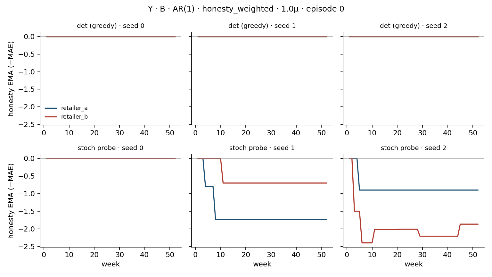

# Honesty-weighted allocation recheck

**Baseline SHA:** `061aa59235397b7360c32a01cf4f98add0dd503a`

Eval-only re-roll of frozen Tier-1 v11 **Regime B × Y × AR(1)** checkpoints under **matched-deterministic** eval (`greedy=True`, seed=`cfg.seed+10000`), consistent with `artifacts/diagnostics/eval_mode_blast_radius.md`. `n_episodes=20`, 10 seeds/cell, wall ≈ 0.5 min. No training / reward / env changes.

**Verdict: `footnote-grade`.** Disengagement survives matched-det (all-role HW 0.381 vs prop 0.514; retailer HW 0.001 vs prop 0.284); EMA is live under stochastic broadcasts (|ΔEMA|=0.760) so this is not an init bug — but the mechanism weights **broadcast** honesty on a babbling channel, so it is footnote-grade ('agents flee a noise-weighted reputation game'), not restored truthful signaling.

## What the logged cells actually weight

**Broadcast truthfulness — not order truthfulness.** `HonestyWeightedRationing` weights ∝ `exp(honesty_ema / T)` where `honesty_ema` is an EMA of `−mean_abs_error` on **signal claims** (`claimed_demand`, `claimed_inventory`) vs observed truth (`beer_distribution_rl/env/signals.py::measure_honesty`, `env/core.py` step 6). Orders never enter the EMA.

Given babbling broadcasts (`v11_signal_content.md`), the logged mechanism is **weighting on noise**. The natural pivot redefinition — weight on **order-truthfulness** (past orders tracking actual need) — was **not** what these cells ran.

## 1. Does the share-drop survive matched-deterministic eval?

Logged (stochastic B) honesty_weighted share ≈ 0.333 vs proportional ≈ 0.492. Matched-det recomputation below. Also report a stochastic probe for HW: all-role 0.334±0.013, retailer 0.044±0.020.

| Cap | Rationing | Share all-role (det) | Retailer share (det) | Logged share | EMA≠0 (det) | mean\|ΔEMA\| (det)
|---|---|---:|---:|---:|---:|---:|
| 1.2μ | proportional | 0.438±0.083 | 0.126±0.109 | 0.473±0.018 | 0.555±0.286 | 1.088±0.764 |
| 1.2μ | uniform | 0.453±0.117 | 0.208±0.124 | 0.481±0.026 | 0.870±0.194 | 1.699±0.483 |
| 1.2μ | honesty_weighted | 0.361±0.109 | 0.000±0.000 | 0.324±0.020 | 0.000±0.000 | 0.000±0.000 |
| 1.0μ | proportional | 0.546±0.110 | 0.345±0.200 | 0.500±0.021 | 0.978±0.036 | 2.153±0.636 |
| 1.0μ | uniform | 0.457±0.069 | 0.260±0.147 | 0.489±0.018 | 0.878±0.186 | 1.905±0.865 |
| 1.0μ | honesty_weighted | 0.376±0.085 | 0.002±0.004 | 0.333±0.021 | 0.004±0.008 | 0.011±0.022 |
| 0.8μ | proportional | 0.559±0.089 | 0.383±0.181 | 0.501±0.023 | 0.871±0.198 | 2.153±0.703 |
| 0.8μ | uniform | 0.536±0.092 | 0.373±0.118 | 0.504±0.023 | 0.919±0.116 | 2.258±0.818 |
| 0.8μ | honesty_weighted | 0.406±0.078 | 0.000±0.000 | 0.342±0.023 | 0.000±0.000 | 0.000±0.000 |

**Directional disengagement survives: `yes`.** Pooled matched-det all-role share: HW **0.381±0.051** vs prop **0.514±0.056** (Δ=0.134) / uni **0.482±0.055**. Retailer-only: HW **0.001±0.001** vs prop **0.284±0.102** (Δ=0.284).

**Numeric '~0.33' all-role level: `roughly yes`** (det HW all-role 0.381). The sharper signal is **retailer** silence under greedy: HW retailer share 0.001 vs prop 0.284 — claimants in the reputation game argmax to never broadcast; upstream roles still broadcast, so all-role share stays near the logged band.

## 2. Is the reputation EMA alive, or a plumbing artifact?

EMA init = `0.0` per role; updates **only** on weeks the agent broadcasts with a non-null claim (`mean_abs_error is not None`). If both stay at 0, `exp(0)=1` ⇒ fill collapses to request-proportional.

**Important:** under matched-det, HW share=0 ⇒ EMA never updates. That flatness is a *consequence* of argmax silence, not evidence the EMA plumbing failed during training (which samples broadcasts). Stochastic probe answers whether reputation moves when broadcasts occur.

| Check | Value | Interpretation |
|---|---:|---|
| Det: frac weeks EMA≠0 | 0.001±0.003 | flat (expected if silent) |
| Det: mean \|EMA_a−EMA_b\| | 0.004±0.007 | cross-agent separation under greedy |
| Stoch probe: share (all-role / retailer) | 0.334±0.013 / 0.044±0.020 | training-like broadcast rate |
| Stoch probe: frac weeks EMA≠0 | 0.624±0.109 | alive when broadcasting |
| Stoch probe: mean \|ΔEMA\| | 0.760±0.215 | cross-agent separation under sampling |
| EMA-never-accumulated artifact? | **no** | EMA moves under stochastic broadcasts — not an init bug |

Figure: episode-0 EMA at 1.0μ, seeds [0, 1, 2]. Top: matched-det (typically flat at 0). Bottom: stochastic probe (EMA should diverge across retailers if reputation accumulates).

## Training-history context (stochastic B eval, sparse)

| Cap | Rationing | Train share first | Train share last |
|---|---|---:|---:|
| 1.2μ | honesty_weighted | 0.446±0.023 | 0.332±0.018 |
| 1.2μ | proportional | 0.506±0.018 | 0.485±0.021 |
| 1.0μ | honesty_weighted | 0.450±0.027 | 0.341±0.020 |
| 1.0μ | proportional | 0.510±0.018 | 0.499±0.021 |
| 0.8μ | honesty_weighted | 0.462±0.022 | 0.354±0.023 |
| 0.8μ | proportional | 0.508±0.017 | 0.497±0.023 |

## Verdict

**`footnote-grade`** — Disengagement survives matched-det (all-role HW 0.381 vs prop 0.514; retailer HW 0.001 vs prop 0.284); EMA is live under stochastic broadcasts (|ΔEMA|=0.760) so this is not an init bug — but the mechanism weights **broadcast** honesty on a babbling channel, so it is footnote-grade ('agents flee a noise-weighted reputation game'), not restored truthful signaling.

Deciding facts:
- Mechanism weights on **broadcasts** (not orders): confirmed in code path.
- Disengagement under matched-det: **yes** (all-role HW 0.381 vs prop 0.514 / uni 0.482; retailer HW 0.001 vs prop 0.284).
- EMA-never-accumulated artifact: **no** (det flat=True; stoch alive=True, \|ΔEMA\|=0.760).
- Pivot: broadcast-weighted P3 on babbling signals is at best footnote-grade; **order-truthfulness weighting** is the re-run worth doing.

