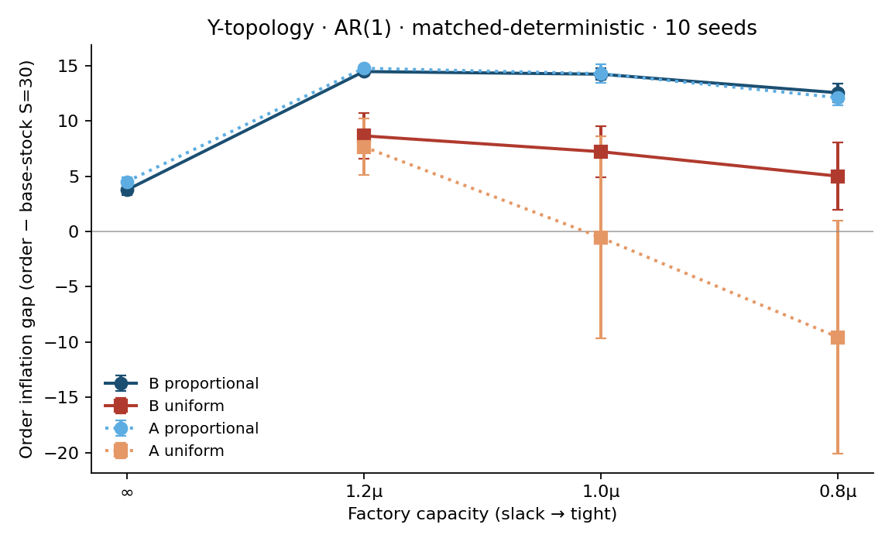

# Shortage gaming (order-stream analysis)

**Baseline SHA:** `061aa59235397b7360c32a01cf4f98add0dd503a`

Analysis-only re-roll of frozen Tier-1 v11 checkpoints under **matched-deterministic** eval (`greedy=True`, seed = `cfg.seed+10000`), consistent with `artifacts/diagnostics/eval_mode_blast_radius.md`. `n_episodes=20`, 10 seeds/cell, wall ≈ 0.5 min. No training / reward / env changes.

**Verdict: `supported`.** Inflation rises with tightness (Δ=8.80) and is higher under proportional than uniform (mean Δ=6.79).

## Thesis

Cheap-talk broadcasts are babbling (`v11_signal_content.md`). The costly ORDER stream is the remaining strategic channel: under multi-claimant rationing, agents can inflate orders to capture allocation (Lee, Padmanabhan & Whang 1997). Bite exists only on **Y** (two retailers, one wholesaler); **serial** is the no-rival negative control. Regime **A** is the no-channel control.

## Operational definitions

1. **Order inflation.** At each retailer order decision, snapshot inventory position `IP = on-hand − backlog + on_order` and observed demand. Truthful benchmark = base-stock order-up-to: `o* = clip(S − IP, 0, order_cap)` with primary **S = 30** (installation stock ≈ μL + zσ√L for AR(1) μ=7.5, L=L_s+L_o=3; BUGHUNT). **Gap** = `order − o*`; **ratio** = `order / max(o*, 1)`. Sensitivity: S ∈ [9, 22, 30, 45] and pass-through `o*=demand`.
2. **Scarcity response.** Does mean gap **increase** as capacity tightens (∞ → 1.2μ → 1.0μ → 0.8μ)? Signature of gaming vs a fixed mechanical policy.
3. **Strategic vs mechanical (crux).** At matched capacity, is inflation **higher under proportional than under uniform**? Proportional awards share by claim size; uniform ignores order size. Rule contrast ⇒ strategic response.
4. **Rival coupling (Y only).** On wholesaler-rationed weeks: corr(own gap, rival *share* of available), corr((own−rival) order, (own−rival) allocation), and tercile share externality `E[rival_share | low own-gap] − E[rival_share | high own-gap]` (positive ⇒ rival share falls when I inflate).

**Gaming label rule:** report inflation as *shortage gaming* only if it responds to **both** capacity tightness **and** rationing rule. Response to neither ⇒ thesis not supported.

## Measure 1 — Order inflation (primary S=30)

Mean gap / ratio over retailer-weeks, aggregated mean±CI95 across 10 seeds. Y-topology; Regime B (and A).

| Regime | Cap | Rationing | Gap (order−S*) | Ratio (order/S*) | Mean order | Frac@128 |
|---|---|---|---:|---:|---:|---:|
| B | ∞ | proportional | 3.76±0.44 | 3.81±0.19 | 7.7 | 0.000 |
| B | 1.2μ | proportional | 14.47±0.33 | 14.37±0.32 | 14.8 | 0.000 |
| B | 1.2μ | uniform | 8.66±2.08 | 9.77±1.42 | 11.6 | 0.000 |
| B | 1.0μ | proportional | 14.23±0.53 | 14.27±0.43 | 14.9 | 0.000 |
| B | 1.0μ | uniform | 7.22±2.32 | 8.62±1.83 | 11.0 | 0.000 |
| B | 0.8μ | proportional | 12.55±0.86 | 13.01±0.72 | 14.1 | 0.000 |
| B | 0.8μ | uniform | 5.01±3.03 | 7.58±1.78 | 10.5 | 0.000 |
| A | ∞ | proportional | 4.52±0.36 | 4.15±0.26 | 7.7 | 0.000 |
| A | 1.2μ | proportional | 14.77±0.33 | 14.67±0.30 | 15.1 | 0.000 |
| A | 1.2μ | uniform | 7.66±2.57 | 9.33±1.92 | 11.5 | 0.000 |
| A | 1.0μ | proportional | 14.28±0.83 | 14.34±0.67 | 14.9 | 0.000 |
| A | 1.0μ | uniform | -0.55±9.14 | 7.30±2.33 | 10.5 | 0.000 |
| A | 0.8μ | proportional | 12.11±0.68 | 12.62±0.55 | 13.8 | 0.000 |
| A | 0.8μ | uniform | -9.56±10.51 | 5.84±1.73 | 9.5 | 0.000 |

### Serial negative control (no rival)

| Regime | Cap | Gap (S=30) | Ratio | Frac@128 |
|---|---|---:|---:|---:|
| B | ∞ | 4.61±0.52 | 2.96±0.47 | 0.000 |
| B | 1.2μ | 7.17±6.38 | 9.60±2.19 | 0.000 |
| B | 1.0μ | 3.56±13.04 | 9.74±2.44 | 0.000 |
| B | 0.8μ | -0.22±12.36 | 7.44±2.47 | 0.000 |
| A | ∞ | 4.49±0.63 | 2.88±0.65 | 0.000 |
| A | 1.2μ | 11.79±1.89 | 11.67±2.00 | 0.000 |
| A | 1.0μ | 11.00±1.03 | 11.10±0.88 | 0.000 |
| A | 0.8μ | 1.43±7.78 | 6.73±2.52 | 0.000 |

## Measure 2 — Scarcity response

Figure: `shortage_gaming_inflation_vs_capacity.png`. B×Y×proportional gap(∞)=3.76, gap(1.2μ) peaks then gap(0.8μ)=12.55, Δ(0.8μ−∞)=8.80; strict monotone across full grid=False (binding region is flat/slightly down; the jump is slack→binding). Scarcity criterion (tight>slack): **True**.

## Measure 3 — Strategic vs mechanical (rationing-rule contrast)

Crux: at fixed capacity on Y, proportional should show **more** inflation than uniform if agents game the rule.

| Cap | B prop gap | B uniform gap | prop−uniform |
|---|---:|---:|---:|
| 1.2μ | 14.47±0.33 | 8.66±2.08 | 5.82 |
| 1.0μ | 14.23±0.53 | 7.22±2.32 | 7.01 |
| 0.8μ | 12.55±0.86 | 5.01±3.03 | 7.54 |

Mean prop−uniform over tight caps = **6.79**. Rule criterion met: **True**.

## Measure 4 — Rival coupling (Y, wholesaler-rationed weeks)

Allocations normalized by wholesaler available (shares). `corr(Δorder, Δalloc)` = correlation of (own−rival) order with (own−rival) fill within the same week — direct competitive link.

| Regime | Cap | Rationing | corr(gap, rival_share) | corr(Δorder, Δalloc) | Externality Δ (rival share low−high gap) |
|---|---|---|---:|---:|---:|
| B | 1.2μ | proportional | -0.13±0.07 | 0.27±0.11 | 0.01±0.00 |
| B | 1.2μ | uniform | -0.11±0.13 | 0.06±0.31 | 0.01±0.02 |
| B | 1.0μ | proportional | -0.09±0.06 | 0.16±0.10 | 0.00±0.00 |
| B | 1.0μ | uniform | -0.00±0.03 | -0.00±0.18 | 0.00±0.01 |
| B | 0.8μ | proportional | -0.15±0.08 | 0.24±0.11 | 0.01±0.01 |
| B | 0.8μ | uniform | -0.05±0.10 | 0.13±0.22 | 0.01±0.02 |
| A | 1.2μ | proportional | -0.12±0.07 | 0.19±0.11 | 0.01±0.00 |
| A | 1.2μ | uniform | -0.08±0.09 | 0.11±0.19 | 0.01±0.01 |
| A | 1.0μ | proportional | -0.08±0.06 | 0.12±0.10 | 0.01±0.01 |
| A | 1.0μ | uniform | -0.19±0.21 | 0.19±0.26 | 0.07±0.11 |
| A | 0.8μ | proportional | -0.21±0.06 | 0.39±0.15 | 0.03±0.02 |
| A | 0.8μ | uniform | -0.16±0.22 | 0.20±0.34 | 0.05±0.10 |

At B×Y×0.8μ: prop corr(Δorder,Δalloc)=0.241 vs uniform 0.133; share externality Δ prop=0.013 (uniform 0.009). Rival criterion: **False**.

## Guardrails

### Benchmark sensitivity (B×Y×0.8μ)

| Benchmark | Prop gap | Uniform gap | prop−uniform |
|---|---:|---:|---:|
| base-stock S=9 | 14.08±0.57 | 10.11±1.63 | 3.96 |
| base-stock S=22 | 13.58±0.67 | 8.10±2.25 | 5.48 |
| base-stock S=30 | 12.55±0.86 | 5.01±3.03 | 7.54 |
| base-stock S=45 | 10.10±1.27 | -1.76±4.59 | 11.86 |
| pass-through (o*=d) | 6.53±0.56 | 2.96±1.15 | 3.56 |

**Order-cap artifact:** frac of retailer orders at 128 under B×Y×0.8μ×prop = 0.0000 (≪5% boundary warn ⇒ not a 128-cap saturation story).

**Serial scarcity Δ** (B, prop, 0.8μ−∞) = -4.82 (no rival; any inflation here is mechanical / bullwhip, not multi-claimant gaming).

## Verdict

**`supported`** — Inflation rises with tightness (Δ=8.80) and is higher under proportional than uniform (mean Δ=6.79).

Deciding numbers:
- Scarcity (B×Y×prop): gap(∞)=3.76 → gap(0.8μ)=12.55 (Δ=8.80; ok=True). Jump is **slack→binding**; within {1.2,1.0,0.8}μ the curve is flat/slightly down (not a further ratchet).
- Rule contrast mean prop−uniform @ tight = 6.79 (ok=True). **Crux holds** across S∈{9,22,30,45} and pass-through.
- Rival @ 0.8μ: corr(Δorder,Δalloc) prop=0.241 vs uni=0.133; share Δ=0.013 (ok=False) — competitive externality is **directional but weak**; not required for the gaming label under the stated rule.
- Serial no-rival control scarcity Δ=−4.82 (does **not** mirror Y’s +8.80).
- A≈B on Y×prop ⇒ order inflation does not need the cheap-talk channel.
- Frac@128=0 ⇒ not an order-cap artifact.

