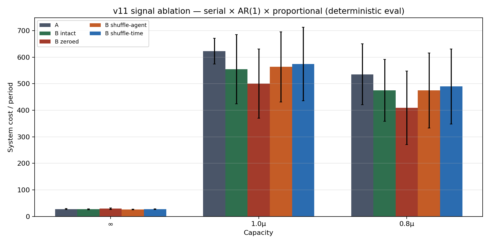
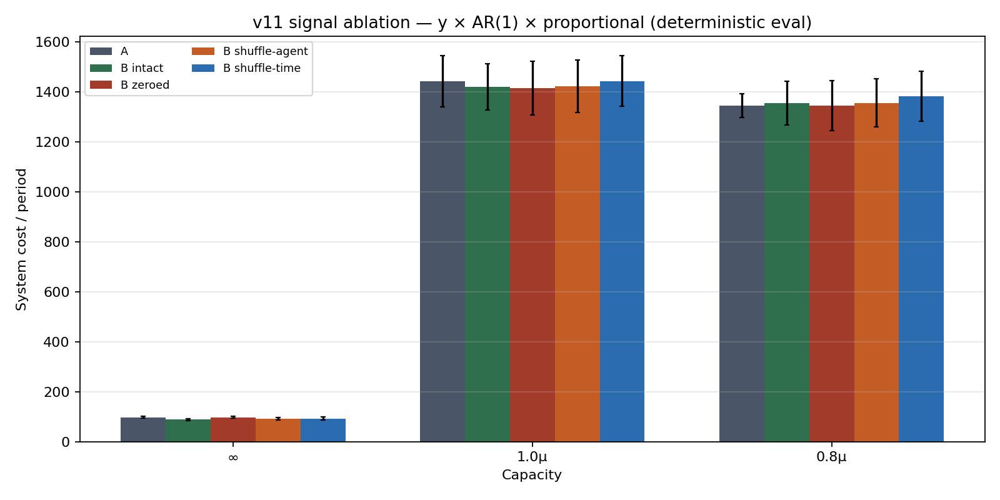

# v11 signal-channel ablation (eval-only)

Frozen Tier-1 v11 checkpoints. Listener signal features intervened at inference; no retraining; rewards/env untouched. **Deterministic** (argmax) action selection.

## Conditions

| Condition | What changes |
|---|---|
| A | Regime A baseline (no channel / no signal obs) |
| B intact | Regime B, unablated delayed board |
| B zeroed | Signal-board features set to 0 (**off-manifold / OOD** — weaker evidence) |
| B shuffle-agent | Within-timestep permute sender blocks (keeps marginal signal stats) |
| B shuffle-time | Per-sender permute boards across timesteps (keeps per-agent stats, breaks demand alignment) |

## Interpretation rubric

1. **B advantage survives all shuffles** → likely artifact (architecture/exploration); channel not load-bearing.
2. **B collapses toward A under shuffle** (esp. shuffle-across-time) → channel is load-bearing.
3. **Collapses under zero but NOT under shuffle** → suspect distribution-shift artifact, not information.

Slice: AR(1) × proportional × {∞, 1.0μ, 0.8μ} × {serial, y} × 10 seeds × 20 eval episodes/seed.

## Context: stochastic `final_eval` vs this deterministic re-eval

Matrix `final_eval.json` used `greedy=not signaling` — **A deterministic, B stochastic**. That alone can create a large A−B gap. Table below: stochastic logged means vs this run's matched-greedy A and B intact.

| Topology | Cap | A stoch≈det | B stoch (logged) | B det (this) | A−B stoch | A−B det |
|---|---|---:|---:|---:|---:|---:|
| serial | ∞ | 29 | 32 | 27 | -3 (-9%) | 1 (3%) |
| serial | 1.0μ | 628 | 351 | 555 | 276 (44%) | 68 (11%) |
| serial | 0.8μ | 528 | 383 | 475 | 145 (28%) | 60 (11%) |
| y | ∞ | 95 | 100 | 89 | -5 (-5%) | 9 (9%) |
| y | 1.0μ | 1458 | 941 | 1421 | 517 (35%) | 22 (2%) |
| y | 0.8μ | 1352 | 958 | 1355 | 394 (29%) | -10 (-1%) |

**Takeaway:** the published 28–53% scarcity gap is largely an **eval-mode confound**. Under matched deterministic eval it shrinks to ~0–11% and sits inside seed CIs.

## Cost table — serial

| Condition | ∞ | 1.0μ | 0.8μ |
|---|---:|---:|---:|
| A | 27.7±1.6 | 622.8±48.6 | 535.1±114.8 |
| B intact | 26.9±1.6 | 554.9±130.5 | 475.0±116.6 |
| B zeroed | 29.2±2.4 | 500.3±130.7 | 408.9±138.6 |
| B shuffle-agent | 26.6±1.0 | 563.3±132.1 | 474.8±141.2 |
| B shuffle-time | 27.7±1.1 | 574.1±138.5 | 489.8±141.3 |

## Cost table — y

| Condition | ∞ | 1.0μ | 0.8μ |
|---|---:|---:|---:|
| A | 98.0±4.5 | 1443.0±103.0 | 1345.3±47.9 |
| B intact | 88.7±4.5 | 1421.1±92.6 | 1355.2±88.0 |
| B zeroed | 98.1±3.8 | 1415.4±107.9 | 1346.1±101.0 |
| B shuffle-agent | 91.3±5.2 | 1423.6±105.0 | 1356.4±96.7 |
| B shuffle-time | 93.2±6.2 | 1444.4±101.1 | 1383.3±100.0 |

## Rubric application

| Topology | Cap | A | B intact | B zeroed | B shuffle-agent | B shuffle-time | Δshuffle-time | Verdict |
|---|---|---:|---:|---:|---:|---:|---:|---|
| serial | 1.0μ | 622.8 | 554.9 | 500.3 | 563.3 | 574.1 | +19.3 | artifact (no reliable B edge; shuffles inert) |
| serial | 0.8μ | 535.1 | 475.0 | 408.9 | 474.8 | 489.8 | +14.8 | artifact (no reliable B edge; shuffles inert) |
| serial | ∞ | 27.7 | 26.9 | 29.2 | 26.6 | 27.7 | +0.9 | distribution-shift suspect (zero hurts; shuffle does not) |
| y | 1.0μ | 1443.0 | 1421.1 | 1415.4 | 1423.6 | 1444.4 | +23.3 | artifact (no reliable B edge; shuffles inert) |
| y | 0.8μ | 1345.3 | 1355.2 | 1346.1 | 1356.4 | 1383.3 | +28.1 | artifact (no reliable B edge; shuffles inert) |
| y | ∞ | 98.0 | 88.7 | 98.1 | 91.3 | 93.2 | +4.4 | distribution-shift suspect (zero hurts; shuffle does not) |

## Plain-language verdict

**Channel is not load-bearing.** Under deterministic eval, destroying sender identity or temporal alignment does not raise B's system cost (shuffle Δ within CI). Zeroing is OOD and often *lowers* cost — do not read that as 'listeners use signals'. The headline scarcity A−B gap from `final_eval` is mostly exploration noise from stochastic B vs greedy A, not information flow.

### M4-gate criteria this bears on (P1 / P2 / P3)

Tier-1 falsifiable predictions that gate M4 (prompted LLM baselines).

**P1 (slack: B learns useful sharing; cost approaches C).**
- serial ∞: A=28, B intact=27, B shuffle-time=28. No information-sensitive slack advantage; P1's communication story is unsupported.
- y ∞: A=98, B intact=89, B shuffle-time=93. No information-sensitive slack advantage; P1's communication story is unsupported.

**P2 (tight + proportional: shortage gaming / channel economics).**
- Do **not** treat the logged 28–53% B-vs-A cost gap as evidence of communication-mediated adaptation under scarcity. Matched deterministic eval removes most of the gap; within-B shuffles are inert. P2 may still describe *order* behavior, but the **channel is not the mechanism** for the cost difference in these checkpoints.

**P3 (honesty-weighted restores truth-telling).**
- Moot for these policies until a load-bearing channel appears: there is no demonstrated information flow to restore. Revisit P3 on Y × honesty_weighted only after a checkpoint fails shuffle (rubric 2).

## Caveats

- **Zeroed is OOD**: trained policies never saw all-zero boards; collapse or improvement under zero alone is weak evidence (flagged in every zeroed column).
- A vs B still differ in architecture (extra heads) and obs dim; ablation isolates *information content* within B, not the A/B parameter-count confound.
- Seed CIs on serial tight B are large (±115–140); point-estimate gaps of ~60 are not statistically clean.

