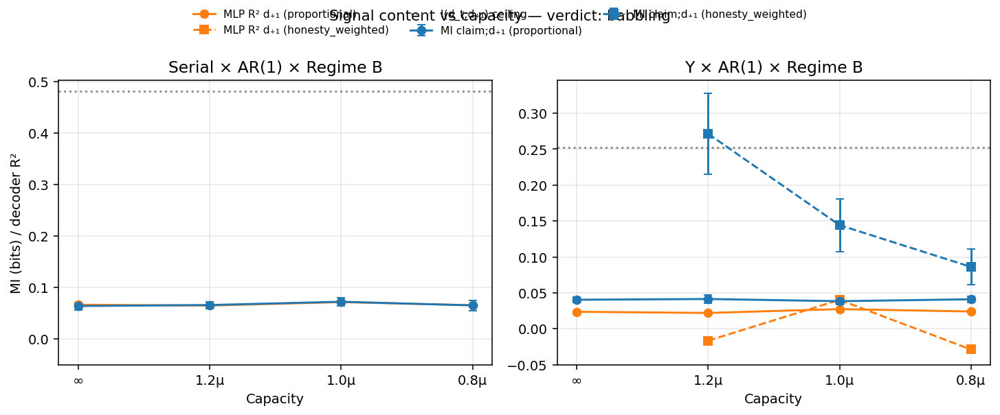

# v11 — Signal content: babbling vs learned code

**Verdict: `babbling`.** Retailer broadcasts carry little next-demand information (MI=0.067 bits vs truthful lag-1 ceiling 0.480; held-out decoder R²=0.067). Share≈0.48 is frequency without content.

Scope: frozen Tier-1 v1.1 **Regime B × AR(1)** checkpoints — serial (proportional) and Y (proportional / honesty_weighted / uniform). Eval-only rollouts; no env/reward/training changes. Conditioning: **agent actually broadcast** (`Signal is not None`) and `claimed_demand` present; **retailers only** (speakers who observe customer demand).

## Estimators

- **MI:** discrete plug-in MI (bits) on integer claim/demand clipped to [0,30], Miller–Madow bias correction; SE = bootstrap (B=40, resample pairs)
- **Decoder:** held-out by training seed: train seeds ∉ {7,8,9}, test ∈ {7,8,9}; features=[claimed_demand]; targets=true_demand_{t+1} and true_demand_t; LinearRegression + MLPRegressor(64)
- **Raw honesty:** logged `eval/honesty_score` = `−mean(|claim−truth|)/order_cap` over broadcasts (MAE-normalized; near 0 even when claims are systematically off by a few units). Also report Pearson `corr(claim, d_t)`.

## Comparison table (retailer broadcasts)

| Topo | Cap | Rationing | Share | Honesty | corr(claim,d_t) | I(claim;d_t) | I(claim;d₊₁)±SE | I(d_t;d₊₁) | Lin R² d₊₁ | MLP R² d₊₁ |
|---|---|---|---:|---:|---:|---:|---:|---:|---:|---:|
| serial | ∞ | proportional | 0.49 | -0.045 | 0.35 | 0.132 | 0.064±0.007 | 0.481 | 0.060 | 0.066 |
| serial | 1.2μ | proportional | 0.49 | -0.037 | 0.34 | 0.126 | 0.066±0.007 | 0.478 | 0.056 | 0.065 |
| serial | 1.0μ | proportional | 0.48 | -0.036 | 0.35 | 0.130 | 0.072±0.008 | 0.485 | 0.069 | 0.071 |
| serial | 0.8μ | proportional | 0.48 | -0.036 | 0.34 | 0.128 | 0.065±0.010 | 0.478 | 0.062 | 0.065 |
| y | ∞ | proportional | 0.51 | -0.055 | 0.29 | 0.083 | 0.040±0.003 | 0.251 | 0.025 | 0.024 |
| y | 1.2μ | proportional | 0.47 | -0.040 | 0.29 | 0.082 | 0.041±0.006 | 0.257 | 0.021 | 0.022 |
| y | 1.2μ | uniform | 0.48 | -0.042 | 0.29 | 0.078 | 0.041±0.005 | 0.253 | 0.028 | 0.033 |
| y | 1.2μ | honesty_weighted | 0.32 | -0.047 | 0.32 | 0.383 | 0.271±0.056 | 0.417 | -0.002 | -0.017 |
| y | 1.0μ | proportional | 0.50 | -0.040 | 0.28 | 0.074 | 0.038±0.004 | 0.249 | 0.020 | 0.027 |
| y | 1.0μ | uniform | 0.49 | -0.041 | 0.28 | 0.076 | 0.041±0.004 | 0.254 | 0.019 | 0.022 |
| y | 1.0μ | honesty_weighted | 0.33 | -0.047 | 0.32 | 0.231 | 0.144±0.037 | 0.308 | 0.038 | 0.040 |
| y | 0.8μ | proportional | 0.50 | -0.041 | 0.30 | 0.079 | 0.041±0.004 | 0.254 | 0.018 | 0.024 |
| y | 0.8μ | uniform | 0.50 | -0.041 | 0.29 | 0.076 | 0.040±0.005 | 0.252 | 0.020 | 0.020 |
| y | 0.8μ | honesty_weighted | 0.34 | -0.047 | 0.30 | 0.119 | 0.086±0.025 | 0.278 | -0.026 | -0.029 |

## Headline means (proportional, pooled across capacities)

| Slice | Share | Honesty | corr | MI claim;d₊₁ | MI d_t;d₊₁ | Lin R² | MLP R² |
|---|---:|---:|---:|---:|---:|---:|---:|
| serial × prop | 0.48 | -0.039 | 0.35 | 0.067 | 0.480 | 0.061 | 0.067 |
| Y × prop | 0.50 | -0.044 | 0.29 | 0.040 | 0.253 | 0.021 | 0.024 |

## Divergence: honesty vs MI vs decoder

- **Honesty** (-0.039) and **share** (0.48) alone are ambiguous: MAE≈4–5 on a 128-cap scale scores near zero whether agents emit noise or a biased-but-decodable code.
- **MI / decoder settle it:** serial I(claim;d₊₁)=0.067 bits is only ~14% of the truthful lag-1 ceiling I(d_t;d₊₁)=0.480; held-out MLP R²=0.067 (linear 0.061). That is residual leakage, not a usable code — shuffle-null R²≈0, but a true affine distortion would clear R²≳0.10 and a large MI fraction.
- **Contemporaneous association is weak, not honest:** corr(claim,d_t)=0.35, I(claim;d_t)=0.129 bits. Consistent with relative claim heads anchored on `last_demand_or_order` (mechanical coupling), not a learned truthful report.
- **Y honesty_weighted MI spike is not a code:** plug-in MI rises (with large bootstrap SE) at some caps, but held-out linear/MLP R² stays ≤0 — the decodability test rejects informative-but-distorted there too.
- **Capacity flat:** serial MI and decoder R² do not rise under slack or tight C — babbling is not a scarcity-phase phenomenon.

## Call for writeup framing

**`babbling`** — Retailer broadcasts carry little next-demand information (MI=0.067 bits vs truthful lag-1 ceiling 0.480; held-out decoder R²=0.067). Share≈0.48 is frequency without content.

Do **not** frame share≈0.5 / honesty≈−0.04 as strategic lying or shortage gaming via cheap talk. Frame as **babbling equilibrium**: agents open the channel at ~coin-flip rate; payload is not a learned encoding of true demand. The alternative hypothesis (informative-but-distorted / lied-but-decodable) is **rejected** by held-out decoders.

Thresholds: MI/MI_truth≥0.25 & MI≥0.05 bits OR held-out decoder R²≥0.10; honesty_score>−0.01 AND corr(claim,d_t)>0.8.

Episodes/seed (this run): 20. Hold-out seeds: [7, 8, 9].
