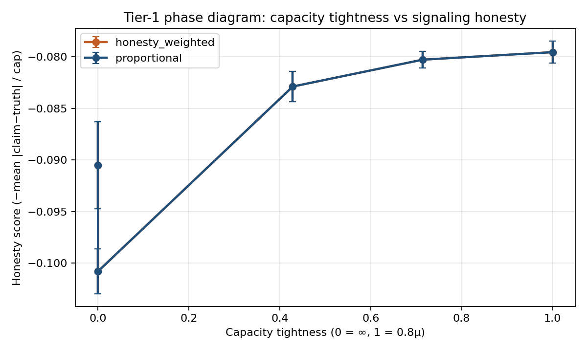
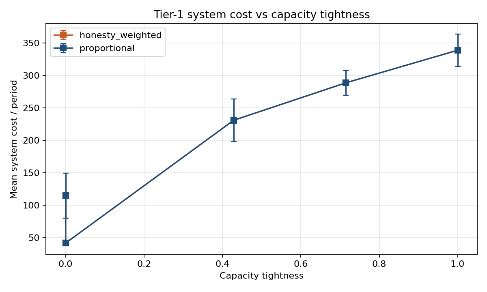

# M3 Phase diagram report

Source: `artifacts/runs/ippo/m3/index.json`  
Matrix: Regime B × {∞, 1.5μ, 1.2μ, 1.0μ, 0.8μ} × {proportional, honesty_weighted} × **10 seeds** × 50k IPPO steps  
Demand: Uniform U[0,15]. One policy+critic per role; local rewards only; signals unverified.

## Predictions (pre-registered)

- **P1** (slack capacity): Regime B shares honestly; system cost approaches Regime C.
- **P2** (tight + proportional): order inflation / honesty collapse.
- **P3** (honesty-weighted): truthful signaling restored.

## Critical design note (serial chain)

On a **serial** beer game each node has a single downstream claimant, so proportional / uniform / honesty-weighted allocations are **mathematically identical** whenever `available < requested` for that one claimant. Honesty-weighted therefore cannot differentiate physical fill on this topology; P3 is not identifiable until Y-topology (or other multi-claimant structure) lands. The two rationing curves in the phase diagram overlap by construction — that is a topology fact, not a bug.

## Results vs predictions

| Prediction | Verdict (Tier-1, this matrix) | Evidence |
|---|---|---|
| P1 | **Partial / weak** | At ∞ capacity: sharing ≈ 0.50 (near prior), honesty ≈ −0.101, cost ≈ 41.7. Agents broadcast half the time but do not clearly learn high honesty or Regime-C-like costs. |
| P2 | **Mixed** | Tightness raises cost 41.7 → 339 and factory inflation 0.22 → 0.28. Honesty score does *not* collapse (slightly less negative under tight capacity). Shortage gaming is cost-visible; deception is not the dominant learned response at 50k steps. |
| P3 | **Not testable on serial** | Honesty-weighted ≡ proportional here. Defer to Y-topology / multi-claimant act. |

## Summary table (n=10)

| Rationing | Cap | Honesty ±CI | Share ±CI | Inflation ±CI | Cost ±CI |
|---|---|---:|---:|---:|---:|
| proportional / honesty_weighted | ∞ | −0.101±0.002 | 0.50±0.03 | 0.22±0.01 | 41.7±1.0 |
| proportional / honesty_weighted | 1.5μ | −0.091±0.004 | 0.53±0.04 | 0.33±0.01 | 114.8±34.5 |
| proportional / honesty_weighted | 1.2μ | −0.083±0.002 | 0.52±0.05 | 0.31±0.01 | 230.8±32.9 |
| proportional / honesty_weighted | 1.0μ | −0.080±0.001 | 0.54±0.06 | 0.29±0.01 | 288.4±19.1 |
| proportional / honesty_weighted | 0.8μ | −0.080±0.001 | 0.52±0.06 | 0.28±0.01 | 338.7±24.9 |

## Figures





## Cuts / next

- **Keep:** capacity–cost phase structure; Tier-1 backbone for choosing LLM cells (∞, 1.0μ, 0.8μ).
- **Designated cut still holds:** Y-topology (needed for P3) and free-form language.
- **M4:** prompted LLM baselines on headline cells only — no GRPO until this Tier-1 picture is accepted.
- **If extending M3:** longer training (150k+) and/or asymmetric costs to sharpen honesty incentives under slack capacity (P1).

## Reproduce

```bash
python scripts/run_m3_matrix.py --regimes B --caps inf,1.5,1.2,1.0,0.8 \
  --rationing proportional,honesty_weighted --seeds 0,1,2,3,4,5,6,7,8,9 \
  --total-timesteps 50000 --out-dir artifacts/runs/ippo/m3 --skip-existing
make figures
```
